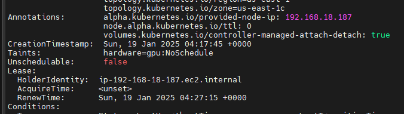

# Kubernetes Taints and Tolerations

Taints and tolerations in Kubernetes are mechanisms used to control which pods can be scheduled on which nodes. They allow you to set constraints that ensure certain pods are not scheduled onto inappropriate nodes.

Taints:

kube scheduler does not schedule any pod on tained nodes. 

Purpose: Taints are applied to nodes to mark them as having special properties or constraints.

Effect: Taints prevent pods that do not tolerate the taint from being scheduled on the node.

Applying a Taint to a Node:

```
kubectl taint nodes <node-name> key=value:NoSchedule
ex: kubectl taint node ip-192-168-18-187.ec2.internal hardware=gpu:NoSchedule
```

Remove the Taint from the Node:

```
kubectl taint nodes node1 hardware:NoSchedule-
ex: kubectl taint node ip-192-168-18-187.ec2.internal hardware=gpu:NoSchedule-
```

You can use kubectl get nodes with a jsonpath expression to list nodes that have taints.

```
kubectl get nodes -o jsonpath='{range .items[*]}{.metadata.name}{"\t"}{.spec.taints[*].key}{"\n"}{end}' | grep -v '^\s*$'
```

You can also use kubectl get nodes with jq to filter and display nodes with taints.

```
kubectl get nodes -o json | jq -r '.items[] | select(.spec.taints) | .metadata.name'
```



key=value: The key-value pair for the taint.
NoSchedule: The effect of the taint. Other possible effects are PreferNoSchedule and NoExecute.

Tolerations

Purpose: Tolerations are applied to pods to allow them to be scheduled on nodes with matching taints.

Effect: Tolerations allow pods to tolerate the taints on nodes, making them eligible to be scheduled on those nodes but not guaranted.

```
apiVersion: v1
kind: Pod
metadata:
  name: pod-tolerate-on-node
spec:
  tolerations:
  - key: "key"
    operator: "Equal"
    value: "value"
    effect: "NoSchedule"
  containers:
  - name: pod-tolerate
    image: nginx

```

key: The key of the taint to tolerate.

operator: The operator to use for the key comparison. Can be Equal or Exists.

value: The value of the taint to tolerate.

effect: The effect of the taint to tolerate. Can be `NoSchedule, PreferNoSchedule, or NoExecute`

# Affinity and anti-affinity

Label Node:

```
kubectl label nodes ip-192-168-18-187.ec2.internal hardware=gpu
```

https://kubernetes.io/docs/tasks/configure-pod-container/assign-pods-nodes/